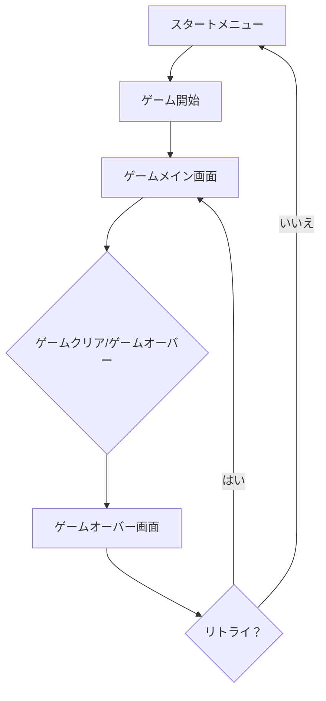
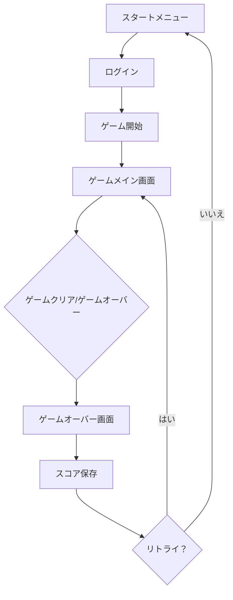

## 1. プロダクト概要
モダンでミニマルなデザインのミニシューティングゲーム。直感的な操作とスムーズなアニメーションで、誰でもすぐに楽しめる本格的なシューティング体験を提供。
- 問題解決：従来のシューティングゲームの複雑さを排除し、モダンなUI/UXで新しいゲーム体験を提供
- ターゲット：カジュアルゲームプレイヤーからコアゲーマーまで、幅広い層
- 市場価値：ブラウザで即座にプレイ可能な高品質なゲーム体験

## 2. コア機能

### 2.1 ユーザーロール
| ロール | 登録方法 | コア権限 |
|------|----------|----------|
| ゲストプレイヤー | 不要 | ゲームプレイ、スコア記録（ローカル） |
| 登録ユーザー | メールまたはソーシャルログイン | ハイスコア保存、ランキング参加、実績解除 |

### 2.2 機能モジュール
モダンミニシューティングゲームは以下の主要ページで構成される：
1. **ゲームメイン画面**: ゲーム本体、プレイヤー操作、敵との戦闘
2. **スタートメニュー**: ゲーム開始、難易度選択、設定、ハイスコア表示
3. **ゲームオーバー画面**: 最終スコア、リトライ、メニューへ戻る

### 2.3 ページ詳細
| ページ名 | モジュール名 | 機能説明 |
|-----------|-------------|-------------|
| スタートメニュー | ゲーム開始ボタン | ゲームを開始する。難易度選択が可能 |
| スタートメニュー | ハイスコア表示 | ローカルまたはオンラインの最高スコアを表示 |
| スタートメニュー | 設定ボタン | 音量、画質、操作設定を変更 |
| ゲームメイン画面 | プレイヤー操作 | マウス/キーボード/タッチで自機を操作。自動射撃 |
| ゲームメイン画面 | 敵システム | 複数の敵タイプ、異なる攻撃パターン、ボス敵 |
| ゲームメイン画面 | パワーアップ | アイテム回収で攻撃力向上、シールド、スピードアップ |
| ゲームメイン画面 | スコアシステム | 撃墜ポイント、コンボボーナス、生存ボーナス |
| ゲームメイン画面 | ライフシステム | プレイヤーのHP管理、ゲームオーバー条件 |
| ゲームオーバー画面 | 結果表示 | 最終スコア、撃墜数、生存時間を表示 |
| ゲームオーバー画面 | リトライ機能 | 同じ難易度で再度ゲーム開始 |

## 3. コアプロセス

### ゲストプレイヤーフロー

### 登録ユーザーフロー

## 4. ユーザインターフェースデザイン

### 4.1 デザインスタイル
- **プライマリカラー**: #00D4FF（サイアン）、#FF006E（ピンク）
- **セカンダリカラー**: #8338EC（パープル）、#3A86FF（ブルー）
- **ボタンスタイル**: 角丸の3D効果、ホバー時の発光アニメーション
- **フォント**: Orbitron（ゲーム用の近未来的フォント）、16px-24px
- **レイアウト**: フルスクリーンゲーム画面、最小限のUIオーバーレイ
- **アイコンスタイル**: 線画アイコン、グロー効果付き

### 4.2 ページデザイン概要
| ページ名 | モジュール名 | UI要素 |
|-----------|-------------|-------------|
| スタートメニュー | メインメニュー | 中央配置のタイトル、発光効果付きボタン、宇宙背景のアニメーション |
| スタートメニュー | ハイスコア表示 | 半透明のパネル、リアルタイム更新、ランキング表示 |
| ゲームメイン画面 | ゲーム画面 | フルスクリーンCanvas、HUD（スコア、HP、コンボ）、最小限のUI |
| ゲームメイン画面 | エフェクト | 粒子効果、スクリーンシェイク、ブラー、グロー効果 |
| ゲームオーバー画面 | 結果画面 | ダークオーバーレイ、大きなスコア表示、統計情報、ボタン |

### 4.3 レスポンシブデザイン
- **デスクトップファースト**: 1920x1080を基準に設計
- **モバイル対応**: タッチ操作の最適化、縦横画面の自動切り替え
- **タブレット対応**: 中型画面での最適な表示
- **パフォーマンス**: デバイス性能に応じた描画品質の自動調整