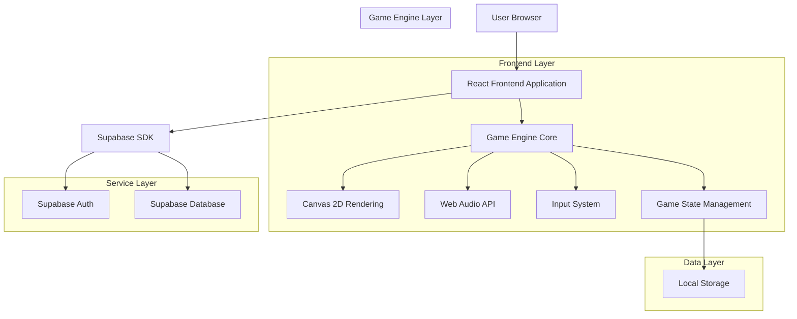
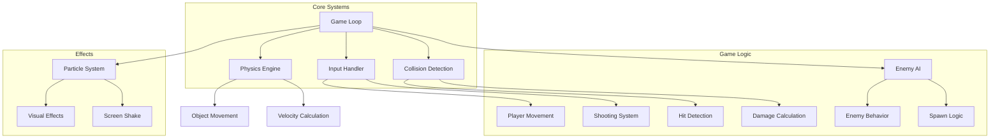
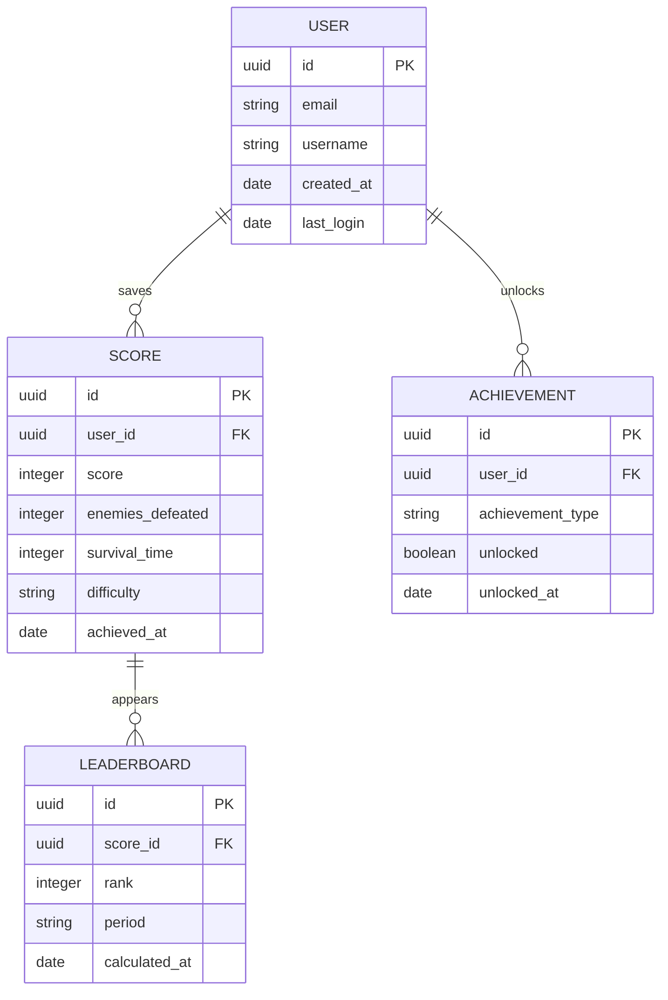

## 1. アーキテクチャ設計



## 2. 技術スタック

- **フロントエンド**: React@18 + TypeScript@5 + Vite@5
- **初期化ツール**: vite-init
- **スタイリング**: TailwindCSS@3 + PostCSS
- **ゲームエンジン**: カスタムCanvas 2Dエンジン
- **アニメーション**: Framer Motion@10
- **サウンド**: Web Audio API + Howler.js
- **状態管理**: Zustand@4
- **バックエンド**: Supabase（認証・スコア保存）
- **デプロイ**: Vercel/Netlify

## 3. ルート定義

| ルート | 目的 |
|-------|------|
| / | スタートメニュー、ゲーム開始画面 |
| /game | メインゲームプレイ画面 |
| /game-over | ゲームオーバー結果画面 |
| /leaderboard | ハイスコアランキング |
| /settings | ゲーム設定（音量、画質、操作） |

## 4. ゲームエンジンコアAPI

### 4.1 ゲームオブジェクト管理
```typescript
interface GameObject {
  id: string;
  x: number;
  y: number;
  width: number;
  height: number;
  velocityX: number;
  velocityY: number;
  health: number;
  update(deltaTime: number): void;
  render(ctx: CanvasRenderingContext2D): void;
  onCollision(other: GameObject): void;
}
```

### 4.2 プレイヤー操作
```typescript
interface PlayerController {
  move(x: number, y: number): void;
  shoot(): void;
  activatePowerUp(type: PowerUpType): void;
  takeDamage(amount: number): void;
}
```

### 4.3 敵システム
```typescript
interface EnemySpawner {
  spawnEnemy(type: EnemyType, position: Vector2D): Enemy;
  setDifficulty(level: number): void;
  getSpawnRate(): number;
}
```

### 4.4 スコア管理
```typescript
interface ScoreManager {
  addScore(points: number): void;
  getCurrentScore(): number;
  getHighScore(): Promise<number>;
  saveHighScore(score: number): Promise<void>;
  getComboMultiplier(): number;
}
```

## 5. ゲームエンジンアーキテクチャ



## 6. データモデル

### 6.1 データモデル定義


### 6.2 データ定義言語

**ユーザーテーブル（users）**
```sql
-- create table
CREATE TABLE users (
  id UUID PRIMARY KEY DEFAULT gen_random_uuid(),
  email VARCHAR(255) UNIQUE NOT NULL,
  username VARCHAR(50) UNIQUE NOT NULL,
  created_at TIMESTAMP WITH TIME ZONE DEFAULT NOW(),
  last_login TIMESTAMP WITH TIME ZONE DEFAULT NOW()
);

-- create index
CREATE INDEX idx_users_email ON users(email);
CREATE INDEX idx_users_username ON users(username);
```

**スコアテーブル（scores）**
```sql
-- create table
CREATE TABLE scores (
  id UUID PRIMARY KEY DEFAULT gen_random_uuid(),
  user_id UUID REFERENCES users(id) ON DELETE CASCADE,
  score INTEGER NOT NULL CHECK (score >= 0),
  enemies_defeated INTEGER DEFAULT 0,
  survival_time INTEGER DEFAULT 0,
  difficulty VARCHAR(20) DEFAULT 'normal' CHECK (difficulty IN ('easy', 'normal', 'hard', 'extreme')),
  achieved_at TIMESTAMP WITH TIME ZONE DEFAULT NOW()
);

-- create index
CREATE INDEX idx_scores_user_id ON scores(user_id);
CREATE INDEX idx_scores_score ON scores(score DESC);
CREATE INDEX idx_scores_achieved_at ON scores(achieved_at DESC);
```

**実績テーブル（achievements）**
```sql
-- create table
CREATE TABLE achievements (
  id UUID PRIMARY KEY DEFAULT gen_random_uuid(),
  user_id UUID REFERENCES users(id) ON DELETE CASCADE,
  achievement_type VARCHAR(50) NOT NULL,
  unlocked BOOLEAN DEFAULT false,
  unlocked_at TIMESTAMP WITH TIME ZONE DEFAULT NOW()
);

-- create index
CREATE INDEX idx_achievements_user_id ON achievements(user_id);
CREATE INDEX idx_achievements_type ON achievements(achievement_type);
```

**権限設定**
```sql
-- 基本的な読み取りアクセス
GRANT SELECT ON users TO anon;
GRANT SELECT ON scores TO anon;
GRANT SELECT ON achievements TO anon;

-- 認証ユーザーの完全アクセス
GRANT ALL PRIVILEGES ON users TO authenticated;
GRANT ALL PRIVILEGES ON scores TO authenticated;
GRANT ALL PRIVILEGES ON achievements TO authenticated;
```

## 7. パフォーマンス最適化

### 7.1 レンダリング最適化
- **オブジェクトプーリング**: 敵、弾、パーティクルの再利用
- **空間分割**: 衝突判定の効率化（QuadTree使用）
- **LOD（Level of Detail）**: 距離に応じた描画詳細度の調整
- **フレームスキップ**: 低性能デバイスでの自動調整

### 7.2 メモリ管理
- **自動ガベージコレクション**: 不要なオブジェクトの自動削除
- **テクスチャアトラス**: 画像リソースの効率的な管理
- **オーディオスプライト**: 効果音の最適化

### 7.3 ネットワーク最適化
- **オフライン対応**: ローカルでのゲームプレイ
- **バッチ同期**: スコアの効率的な送信
- **キャッシュ戦略**: 頻繁なデータのローカル保存