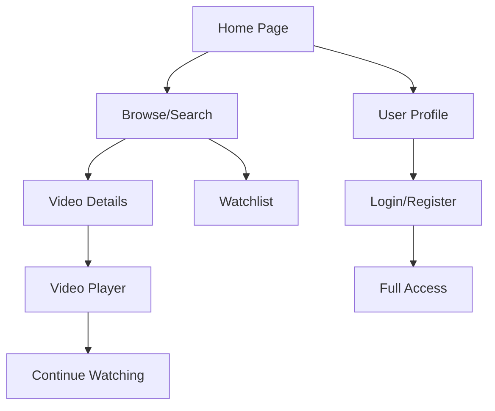

## 1. Product Overview

A Netflix-like video streaming service that allows users to browse, search, and watch video content with personalized recommendations and user profiles. The service provides a modern, responsive interface for video consumption across multiple devices.

- Target users: General consumers seeking entertainment content
- Market value: Provides accessible video streaming with intuitive user experience and content discovery features

## 2. Core Features

### 2.1 User Roles

| Role | Registration Method | Core Permissions |
|------|---------------------|------------------|
| Guest User | No registration required | Browse content, view trailers, limited video preview |
| Registered User | Email registration | Full video access, create watchlist, continue watching, rate content |
| Premium User | Subscription upgrade | HD/4K streaming, multiple profiles, download for offline viewing |

### 2.2 Feature Module

The video streaming service consists of the following main pages:
1. **Home page**: Hero banner, category-based video rows, personalized recommendations, navigation header
2. **Browse page**: Category filters, genre navigation, trending content, new releases
3. **Video player page**: Full-screen video player, playback controls, subtitles, quality selection, next episode suggestions
4. **Search page**: Search bar, search results with filters, content suggestions
5. **User profile page**: Profile management, viewing history, watchlist, account settings
6. **Login/Register page**: Authentication forms, social login options, password recovery

### 2.3 Page Details

| Page Name | Module Name | Feature description |
|-----------|-------------|---------------------|
| Home page | Hero banner | Display featured content with auto-playing preview, title, description, and play button |
| Home page | Video rows | Horizontal scrolling rows organized by categories (Trending, New Releases, Top 10, etc.) |
| Home page | Navigation header | Logo, main menu, search icon, user profile avatar, responsive hamburger menu |
| Browse page | Category filters | Genre-based filtering, year filters, rating filters, content type selection |
| Browse page | Content grid | Grid layout of video thumbnails with hover effects showing preview and details |
| Video player page | Video controls | Play/pause, seek bar, volume control, fullscreen toggle, playback speed |
| Video player page | Quality selection | Auto, 720p, 1080p, 4K options based on user's connection and subscription |
| Video player page | Subtitles | Multiple language subtitle options, closed captions toggle |
| Search page | Search functionality | Real-time search suggestions, search history, voice search option |
| Search page | Results display | Filtered results by relevance, genre, year, with sorting options |
| User profile page | Profile management | Multiple profiles per account, profile pictures, viewing preferences |
| User profile page | Watchlist | Add/remove content, continue watching list, viewing progress tracking |
| Login/Register page | Authentication | Email/password login, social login (Google, Facebook), remember me option |

## 3. Core Process

### User Flow (Registered User)
1. User lands on homepage and sees personalized content recommendations
2. User can browse categories or search for specific content
3. User clicks on video thumbnail to view details or play immediately
4. Video player opens with full-screen experience and controls
5. User can add content to watchlist for later viewing
6. System tracks viewing progress for "continue watching" feature
7. User can switch between profiles for personalized experiences

### Guest User Flow
1. Browse available content with limited preview access
2. View trailers and content descriptions
3. Prompted to register for full access when attempting to watch

## 4. User Interface Design

### 4.1 Design Style
- **Primary colors**: Dark theme (#141414 background, #E50914 Netflix red accent)
- **Secondary colors**: Gray tones (#564D4D, #808080, #B3B3B3) for text and UI elements
- **Button style**: Rounded corners, gradient hover effects, prominent red for primary actions
- **Typography**: Netflix Sans or similar sans-serif, 16px base font size
- **Layout**: Card-based design, full-width hero sections, responsive grid layouts
- **Icons**: Minimalist line icons, smooth animations, intuitive symbols

### 4.2 Page Design Overview

| Page Name | Module Name | UI Elements |
|-----------|-------------|-------------|
| Home page | Hero banner | Full-width video background with gradient overlay, large title text, play/info buttons positioned bottom-left |
| Home page | Video rows | Horizontal scrolling rows with video cards, smooth hover animations showing title and rating |
| Video player page | Controls bar | Semi-transparent black bar at bottom, large play button, progress bar with preview thumbnails |
| Search page | Search bar | Prominent search input at top, instant suggestions dropdown, clear search button |
| User profile page | Profile cards | Circular profile pictures, easy switching animation, viewing statistics display |

### 4.3 Responsiveness
- **Desktop-first**: Optimized for large screens (1920px+), 3-column grid layout
- **Tablet adaptation**: 2-column grid, adjusted hero banner height, touch-friendly controls
- **Mobile optimization**: Single column layout, swipe gestures for navigation, bottom navigation bar
- **Touch interactions**: Swipe for video rows, pinch to zoom on video details, tap-to-play functionality