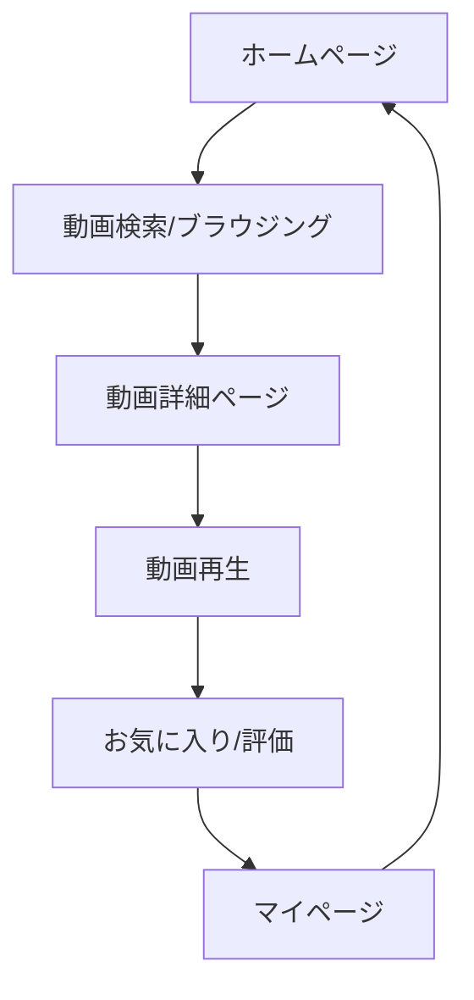

## 1. 製品概要
モダンでかっこいいデザインの動画配信プラットフォーム。Netflixのような直感的なUIで、ユーザーが快適に動画を視聴できるサービス。
- 問題解決: 従来の動画配信サービスの複雑なUIを改善し、シンプルで美しいデザインを提供
- 対象ユーザー: 動画コンテンツを楽しみたい全てのユーザー
- 価値提供: 高品質な視聴体験とパーソナライズされたコンテンツ推薦

## 2. コア機能

### 2.1 ユーザーロール
| ロール | 登録方法 | コア権限 |
|------|----------|----------|
| 一般ユーザー | メールアドレス登録 | 動画視聴、検索、お気に入り登録 |
| プレミアム会員 | 支払いアップグレード | 高画質視聴、ダウンロード、複数デバイス同時視聴 |

### 2.2 機能モジュール
動画配信サイトは以下の主要ページで構成される：
1. **ホームページ**: ヒーローセクション、おすすめ動画、カテゴリ別一覧
2. **動画再生ページ**: 動画プレーヤー、関連動画、コメント
3. **検索ページ**: 検索バー、フィルター、検索結果
4. **マイページ**: 視聴履歴、お気に入り、アカウント設定

### 2.3 ページ詳細
| ページ名 | モジュール名 | 機能説明 |
|-----------|-------------|-------------|
| ホームページ | ヒーローセクション | トレンド動画を自動スライドショーで表示、再生ボタンで即座に視聴開始 |
| ホームページ | カテゴリ別一覧 | ジャンル別に動画をカルーセル形式で表示、ホバーでプレビュー表示 |
| ホームページ | ナビゲーションバー | ロゴ、検索ボックス、ユーザープロフィール、メニューアクセス |
| 動画再生ページ | 動画プレーヤー | 再生/一時停止、音量調整、画質選択、字幕、全画面表示 |
| 動画再生ページ | 関連動画 | 視聴中の動画に関連するコンテンツを表示 |
| 動画再生ページ | 動画情報 | タイトル、説明文、キャスト、公開年、評価を表示 |
| 検索ページ | 検索バー | リアルタイム検索、検索履歴、サジェスト機能 |
| 検索ページ | フィルター | ジャンル、年代、評価、再生時間での絞り込み |
| 検索ページ | 検索結果 | グリッドレイアウトで動画サムネイルと基本情報を表示 |
| マイページ | 視聴履歴 | 視聴済み動画の一覧、続きから再生ボタン |
| マイページ | お気に入り | ユーザーが保存した動画の管理 |
| マイページ | アカウント設定 | プロフィール編集、パスワード変更、支払い方法管理 |

## 3. コアプロセス
### 一般ユーザーフロー
1. ホームページでトレンド動画を閲覧
2. 検索またはカテゴリブラウジングで興味のある動画を発見
3. 動画をクリックして詳細ページへ
4. 動画を再生して視聴開始
5. お気に入りに追加または評価を行う

## 4. ユーザーインターフェースデザイン

### 4.1 デザインスタイル
- **プライマリカラー**: #E50914 (Netflixレッド)
- **セカンダリカラー**: #141414 (ダークグレー)
- **背景色**: #000000 (ブラック)
- **テキスト色**: #FFFFFF (ホワイト)
- **ボタンスタイル**: 角丸なし、ホバー時に明るくなる
- **フォント**: Helvetica Neue, Arial, sans-serif
- **レイアウト**: カードベース、グリッドシステム
- **アニメーション**: スムーズなフェードイン、スライド効果

### 4.2 ページデザイン概要
| ページ名 | モジュール名 | UI要素 |
|-----------|-------------|-------------|
| ホームページ | ヒーローセクション | 全画面背景画像、中央に大きな再生ボタン、フェードインアニメーション |
| ホームページ | カテゴリ一覧 | 横スクロールカルーセル、ホバーで拡大、影付きカードデザイン |
| 動画再生ページ | プレーヤー | ブラックのコントロールバー、大きな再生ボタン、シンプルなアイコン |
| 検索ページ | 検索バー | 白い背景、赤い検索ボタン、自動補完表示 |
| マイページ | 視聴履歴 | グリッドレイアウト、サムネイル画像、視聴進捗バー |

### 4.3 レスポンシブデザイン
- **デスクトップファースト**: 1920pxベースで設計
- **モバイル対応**: スマートフォン、タブレットに最適化
- **タッチ対応**: モバイルデバイスでのスワイプ操作対応
- **ブレークポイント**: 768px（タブレット）、480px（スマートフォン）