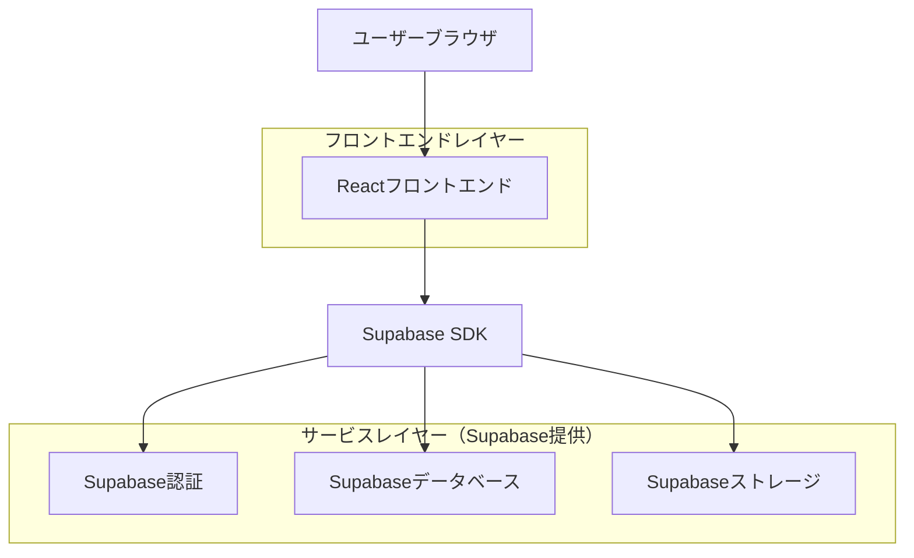
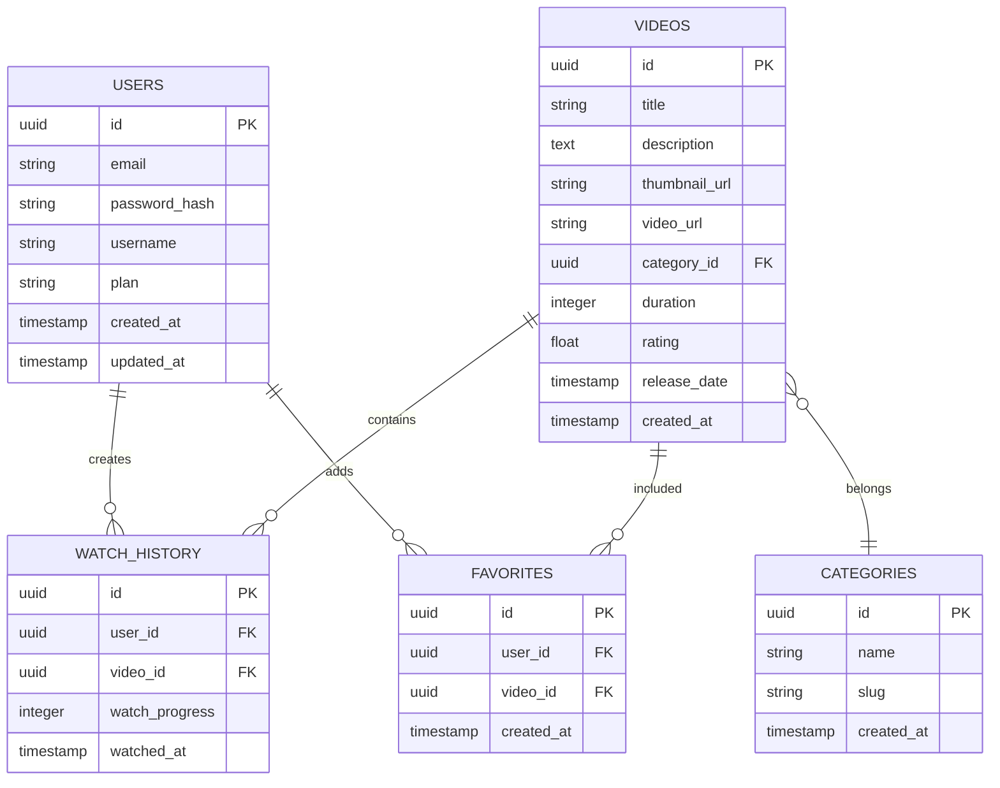

## 1. アーキテクチャ設計



## 2. 技術スタック
- **フロントエンド**: React@18 + TypeScript@5 + Tailwind CSS@3
- **初期化ツール**: vite-init
- **バックエンド**: Supabase（認証、データベース、ストレージ）
- **動画プレーヤー**: React Player
- **状態管理**: React Context API
- **ルーティング**: React Router@6

## 3. ルート定義
| ルート | 目的 |
|-------|---------|
| / | ホームページ、トレンド動画とカテゴリ表示 |
| /login | ログインページ、ユーザー認証 |
| /register | 新規登録ページ、アカウント作成 |
| /watch/:id | 動画再生ページ、動画プレーヤー |
| /search | 検索ページ、動画検索とフィルタリング |
| /profile | マイページ、視聴履歴とお気に入り |
| /settings | アカウント設定ページ、プロフィール管理 |

## 4. API定義

### 4.1 認証API
```
POST /api/auth/login
```

リクエスト:
| パラメータ名 | パラメータ型 | 必須 | 説明 |
|-----------|-------------|------|-------------|
| email | string | true | ユーザーメールアドレス |
| password | string | true | パスワード |

レスポンス:
| パラメータ名 | パラメータ型 | 説明 |
|-----------|-------------|-------------|
| user | object | ユーザー情報 |
| session | object | 認証セッション |

### 4.2 動画API
```
GET /api/videos
```

クエリパラメータ:
| パラメータ名 | パラメータ型 | 必須 | 説明 |
|-----------|-------------|------|-------------|
| category | string | false | カテゴリフィルター |
| limit | number | false | 取得件数（デフォルト: 20） |
| offset | number | false | オフセット（デフォルト: 0） |

## 5. データモデル

### 5.1 データモデル定義


### 5.2 データ定義言語

**ユーザーテーブル (users)**
```sql
-- テーブル作成
CREATE TABLE users (
    id UUID PRIMARY KEY DEFAULT gen_random_uuid(),
    email VARCHAR(255) UNIQUE NOT NULL,
    password_hash VARCHAR(255) NOT NULL,
    username VARCHAR(100) UNIQUE NOT NULL,
    plan VARCHAR(20) DEFAULT 'free' CHECK (plan IN ('free', 'premium')),
    created_at TIMESTAMP WITH TIME ZONE DEFAULT NOW(),
    updated_at TIMESTAMP WITH TIME ZONE DEFAULT NOW()
);

-- インデックス作成
CREATE INDEX idx_users_email ON users(email);
CREATE INDEX idx_users_username ON users(username);

-- 初期データ
INSERT INTO users (email, password_hash, username, plan) VALUES
('demo@example.com', '$2b$10$demo', 'demo_user', 'free');
```

**動画テーブル (videos)**
```sql
-- テーブル作成
CREATE TABLE videos (
    id UUID PRIMARY KEY DEFAULT gen_random_uuid(),
    title VARCHAR(255) NOT NULL,
    description TEXT,
    thumbnail_url VARCHAR(500),
    video_url VARCHAR(500) NOT NULL,
    category_id UUID REFERENCES categories(id),
    duration INTEGER NOT NULL, -- 秒単位
    rating FLOAT DEFAULT 0.0,
    release_date DATE,
    created_at TIMESTAMP WITH TIME ZONE DEFAULT NOW()
);

-- インデックス作成
CREATE INDEX idx_videos_category ON videos(category_id);
CREATE INDEX idx_videos_rating ON videos(rating DESC);
CREATE INDEX idx_videos_release_date ON videos(release_date DESC);
```

**カテゴリテーブル (categories)**
```sql
-- テーブル作成
CREATE TABLE categories (
    id UUID PRIMARY KEY DEFAULT gen_random_uuid(),
    name VARCHAR(100) NOT NULL,
    slug VARCHAR(100) UNIQUE NOT NULL,
    created_at TIMESTAMP WITH TIME ZONE DEFAULT NOW()
);

-- 初期データ
INSERT INTO categories (name, slug) VALUES
('アクション', 'action'),
('コメディ', 'comedy'),
('ドラマ', 'drama'),
('ホラー', 'horror'),
('SF', 'sci-fi'),
('ドキュメンタリー', 'documentary');
```

**視聴履歴テーブル (watch_history)**
```sql
-- テーブル作成
CREATE TABLE watch_history (
    id UUID PRIMARY KEY DEFAULT gen_random_uuid(),
    user_id UUID REFERENCES users(id) ON DELETE CASCADE,
    video_id UUID REFERENCES videos(id) ON DELETE CASCADE,
    watch_progress INTEGER DEFAULT 0, -- 秒単位
    watched_at TIMESTAMP WITH TIME ZONE DEFAULT NOW(),
    UNIQUE(user_id, video_id)
);

-- インデックス作成
CREATE INDEX idx_watch_history_user ON watch_history(user_id);
CREATE INDEX idx_watch_history_video ON watch_history(video_id);
CREATE INDEX idx_watch_history_watched_at ON watch_history(watched_at DESC);
```

**お気に入りテーブル (favorites)**
```sql
-- テーブル作成
CREATE TABLE favorites (
    id UUID PRIMARY KEY DEFAULT gen_random_uuid(),
    user_id UUID REFERENCES users(id) ON DELETE CASCADE,
    video_id UUID REFERENCES videos(id) ON DELETE CASCADE,
    created_at TIMESTAMP WITH TIME ZONE DEFAULT NOW(),
    UNIQUE(user_id, video_id)
);

-- インデックス作成
CREATE INDEX idx_favorites_user ON favorites(user_id);
CREATE INDEX idx_favorites_video ON favorites(video_id);
```

### 5.3 Supabase RLS（Row Level Security）設定
```sql
-- ビデオテーブルのRLS
ALTER TABLE videos ENABLE ROW LEVEL SECURITY;

-- 匿名ユーザーでも読み取り可能
CREATE POLICY "Videos are viewable by everyone" ON videos
    FOR SELECT USING (true);

-- 認証済みユーザーへの全権限
GRANT SELECT ON videos TO anon;
GRANT ALL ON videos TO authenticated;

-- その他のテーブルも同様に設定
ALTER TABLE categories ENABLE ROW LEVEL SECURITY;
CREATE POLICY "Categories are viewable by everyone" ON categories
    FOR SELECT USING (true);
GRANT SELECT ON categories TO anon;
GRANT ALL ON categories TO authenticated;
```