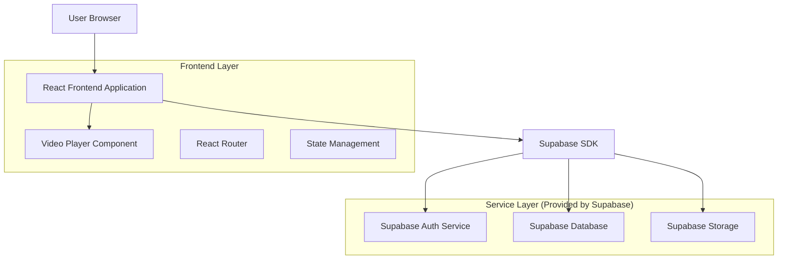
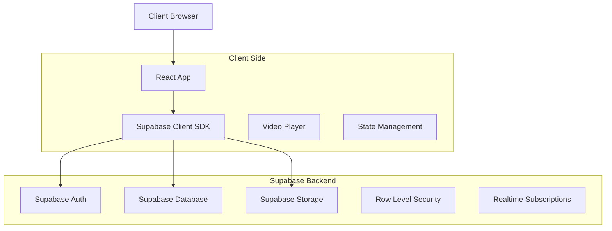
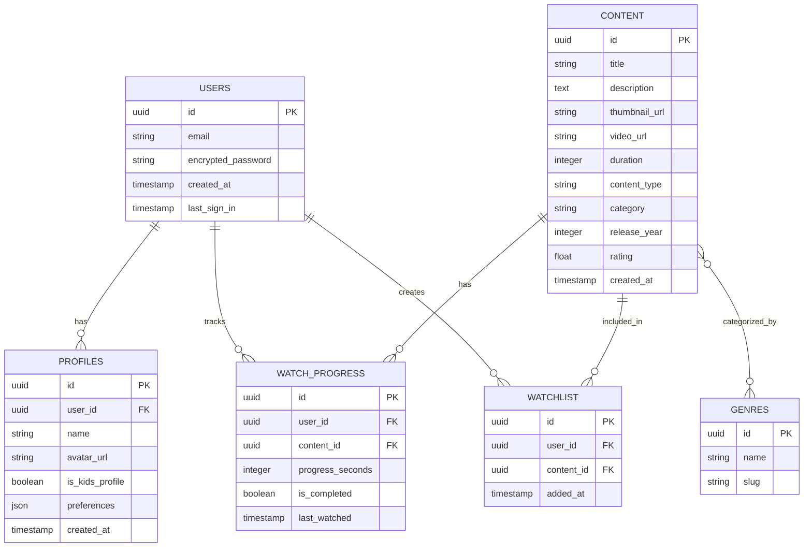

## 1. Architecture design



## 2. Technology Description

- Frontend: React@18 + TypeScript + TailwindCSS@3 + Vite
- Initialization Tool: vite-init
- Backend: Supabase (Authentication, Database, Storage)
- Video Player: Video.js + HLS.js for adaptive streaming
- State Management: React Context + useReducer for global state
- Routing: React Router v6

## 3. Route definitions

| Route | Purpose |
|-------|---------|
| / | Home page with hero banner and content categories |
| /browse | Browse all content with filters and categories |
| /search | Search functionality with results display |
| /watch/:id | Video player page for streaming content |
| /profile | User profile and account management |
| /watchlist | User's saved content list |
| /login | User authentication page |
| /register | New user registration page |
| /continue-watching | Resume partially watched content |

## 4. API definitions

### 4.1 Core API

#### User Authentication
```
POST /auth/v1/token
```

Request:
| Param Name| Param Type  | isRequired  | Description |
|-----------|-------------|-------------|-------------|
| email     | string      | true        | User email address |
| password  | string      | true        | User password |

Response:
| Param Name| Param Type  | Description |
|-----------|-------------|-------------|
| access_token | string   | JWT access token |
| refresh_token | string  | JWT refresh token |
| user      | object      | User profile data |

#### Content Fetching
```
GET /rest/v1/content
```

Query Parameters:
| Param Name| Param Type  | isRequired  | Description |
|-----------|-------------|-------------|-------------|
| category  | string      | false       | Content category filter |
| genre     | string      | false       | Genre filter |
| limit     | number      | false       | Number of results (default: 20) |
| offset    | number      | false       | Pagination offset |

Response:
| Param Name| Param Type  | Description |
|-----------|-------------|-------------|
| id        | string      | Content unique identifier |
| title     | string      | Content title |
| description | string    | Content description |
| thumbnail_url | string  | Thumbnail image URL |
| video_url | string      | Video streaming URL |
| duration  | number      | Video duration in seconds |
| category  | string      | Content category |
| genre     | array       | Array of genre strings |
| rating    | number      | User rating (1-10) |
| release_year | number   | Content release year |

#### Watch Progress Tracking
```
POST /rest/v1/watch_progress
```

Request:
| Param Name| Param Type  | isRequired  | Description |
|-----------|-------------|-------------|-------------|
| content_id | string     | true        | Content identifier |
| progress  | number      | true        | Watch progress in seconds |
| completed | boolean     | false       | Whether content is completed |

## 5. Server architecture diagram



## 6. Data model

### 6.1 Data model definition



### 6.2 Data Definition Language

#### Users Table
```sql
-- Create users table (managed by Supabase Auth)
CREATE TABLE users (
    id UUID PRIMARY KEY DEFAULT auth.uid(),
    email VARCHAR(255) UNIQUE NOT NULL,
    created_at TIMESTAMP WITH TIME ZONE DEFAULT NOW(),
    updated_at TIMESTAMP WITH TIME ZONE DEFAULT NOW()
);

-- Enable Row Level Security
ALTER TABLE users ENABLE ROW LEVEL SECURITY;

-- Create policies
CREATE POLICY "Users can view their own data" ON users
    FOR SELECT USING (auth.uid() = id);
```

#### Profiles Table
```sql
-- Create profiles table
CREATE TABLE profiles (
    id UUID PRIMARY KEY DEFAULT gen_random_uuid(),
    user_id UUID REFERENCES auth.users(id) ON DELETE CASCADE,
    name VARCHAR(100) NOT NULL,
    avatar_url TEXT,
    is_kids_profile BOOLEAN DEFAULT FALSE,
    preferences JSONB DEFAULT '{}',
    created_at TIMESTAMP WITH TIME ZONE DEFAULT NOW(),
    updated_at TIMESTAMP WITH TIME ZONE DEFAULT NOW()
);

-- Enable Row Level Security
ALTER TABLE profiles ENABLE ROW LEVEL SECURITY;

-- Create policies
CREATE POLICY "Users can manage their profiles" ON profiles
    FOR ALL USING (auth.uid() = user_id);

-- Grant permissions
GRANT ALL ON profiles TO authenticated;
GRANT SELECT ON profiles TO anon;
```

#### Content Table
```sql
-- Create content table
CREATE TABLE content (
    id UUID PRIMARY KEY DEFAULT gen_random_uuid(),
    title VARCHAR(255) NOT NULL,
    description TEXT,
    thumbnail_url TEXT NOT NULL,
    video_url TEXT NOT NULL,
    duration INTEGER NOT NULL, -- in seconds
    content_type VARCHAR(50) NOT NULL, -- 'movie', 'tv_show', 'documentary'
    category VARCHAR(100) NOT NULL,
    release_year INTEGER,
    rating DECIMAL(2,1) DEFAULT 0,
    created_at TIMESTAMP WITH TIME ZONE DEFAULT NOW(),
    updated_at TIMESTAMP WITH TIME ZONE DEFAULT NOW()
);

-- Enable Row Level Security
ALTER TABLE content ENABLE ROW LEVEL SECURITY;

-- Create policies
CREATE POLICY "Anyone can view content" ON content
    FOR SELECT USING (true);

-- Grant permissions
GRANT SELECT ON content TO anon, authenticated;
```

#### Watch Progress Table
```sql
-- Create watch progress table
CREATE TABLE watch_progress (
    id UUID PRIMARY KEY DEFAULT gen_random_uuid(),
    user_id UUID REFERENCES auth.users(id) ON DELETE CASCADE,
    content_id UUID REFERENCES content(id) ON DELETE CASCADE,
    progress_seconds INTEGER DEFAULT 0,
    is_completed BOOLEAN DEFAULT FALSE,
    last_watched TIMESTAMP WITH TIME ZONE DEFAULT NOW(),
    created_at TIMESTAMP WITH TIME ZONE DEFAULT NOW(),
    updated_at TIMESTAMP WITH TIME ZONE DEFAULT NOW(),
    UNIQUE(user_id, content_id)
);

-- Enable Row Level Security
ALTER TABLE watch_progress ENABLE ROW LEVEL SECURITY;

-- Create policies
CREATE POLICY "Users can manage their watch progress" ON watch_progress
    FOR ALL USING (auth.uid() = user_id);

-- Grant permissions
GRANT ALL ON watch_progress TO authenticated;
```

#### Watchlist Table
```sql
-- Create watchlist table
CREATE TABLE watchlist (
    id UUID PRIMARY KEY DEFAULT gen_random_uuid(),
    user_id UUID REFERENCES auth.users(id) ON DELETE CASCADE,
    content_id UUID REFERENCES content(id) ON DELETE CASCADE,
    added_at TIMESTAMP WITH TIME ZONE DEFAULT NOW(),
    UNIQUE(user_id, content_id)
);

-- Enable Row Level Security
ALTER TABLE watchlist ENABLE ROW LEVEL SECURITY;

-- Create policies
CREATE POLICY "Users can manage their watchlist" ON watchlist
    FOR ALL USING (auth.uid() = user_id);

-- Grant permissions
GRANT ALL ON watchlist TO authenticated;
```

#### Genres Table
```sql
-- Create genres table
CREATE TABLE genres (
    id UUID PRIMARY KEY DEFAULT gen_random_uuid(),
    name VARCHAR(100) NOT NULL,
    slug VARCHAR(100) UNIQUE NOT NULL,
    created_at TIMESTAMP WITH TIME ZONE DEFAULT NOW()
);

-- Insert sample genres
INSERT INTO genres (name, slug) VALUES
    ('Action', 'action'),
    ('Comedy', 'comedy'),
    ('Drama', 'drama'),
    ('Horror', 'horror'),
    ('Romance', 'romance'),
    ('Sci-Fi', 'sci-fi'),
    ('Thriller', 'thriller'),
    ('Documentary', 'documentary');

-- Grant permissions
GRANT SELECT ON genres TO anon, authenticated;
```

### 6.3 Indexes for Performance
```sql
-- Create indexes for better query performance
CREATE INDEX idx_content_category ON content(category);
CREATE INDEX idx_content_type ON content(content_type);
CREATE INDEX idx_content_rating ON content(rating DESC);
CREATE INDEX idx_content_year ON content(release_year DESC);
CREATE INDEX idx_watch_progress_user ON watch_progress(user_id);
CREATE INDEX idx_watch_progress_content ON watch_progress(content_id);
CREATE INDEX idx_watchlist_user ON watchlist(user_id);
CREATE INDEX idx_profiles_user ON profiles(user_id);
```