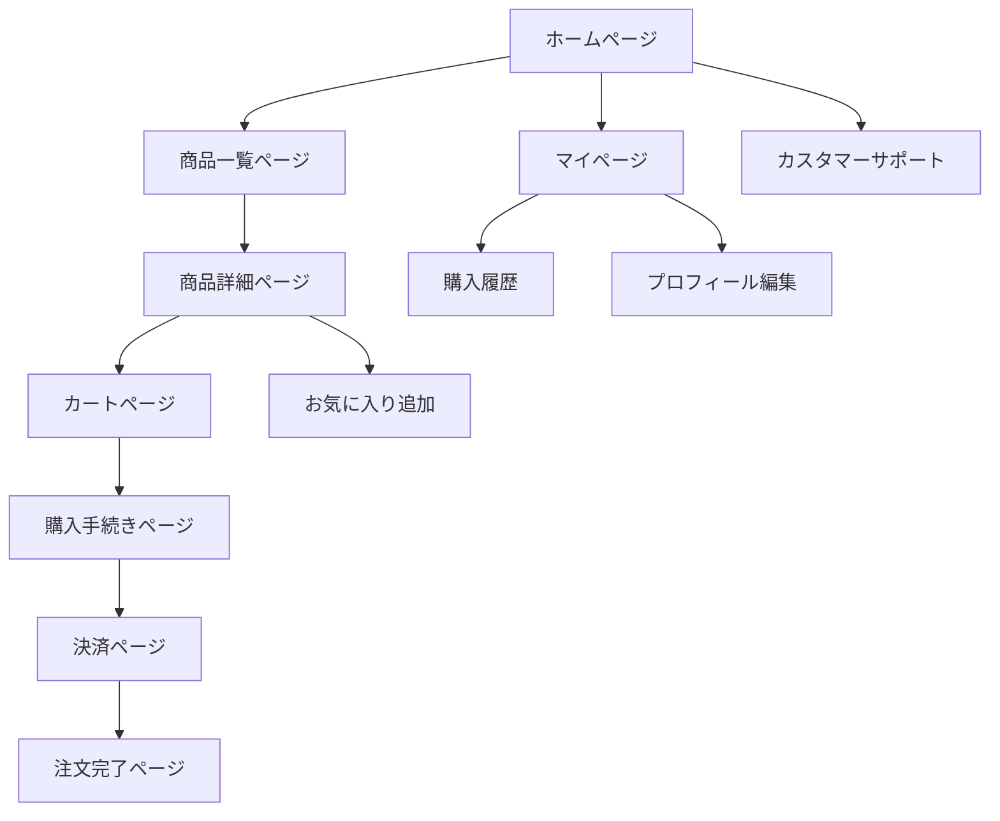

## 1. 製品概要
日本の女性向けファッションECサイト。ZARAやH&Mを参考にしたクリーンでモダンなデザインを採用し、スマートフォンにも完全対応。シンプルながらも洗練されたショッピング体験を提供し、最新トレンドのファッションアイテムを効率的に購入できるプラットフォーム。

- 20代〜40代の女性をメインターゲットに、最新トレンドを取り入れたファッションアイテムを提供
- 直感的で使いやすいインターフェースにより、ストレスフリーな買い物体験を実現
- 多言語対応（日本語メイン）で観光客にも対応し、市場拡大を目指す

## 2. コア機能

### 2.1 ユーザーロール
| ロール | 登録方法 | コア権限 |
|------|----------|----------|
| 一般ユーザー | メールアドレス登録 | 商品閲覧・購入、レビュー投稿、お気に入り登録 |
| ゲストユーザー | 不要 | 商品閲覧のみ、購入時に会員登録が必要 |
| 管理者 | 管理画面から作成 | 商品管理、在庫管理、注文管理、ユーザー管理 |

### 2.2 機能モジュール
本ファッションECサイトは以下の主要ページで構成されます：
1. **ホームページ**：ヒーローバナー、新着アイテム、人気商品、新規ユーザー向けポップアップ
2. **商品一覧ページ**：商品グリッド表示、検索・絞り込み機能、ページネーション
3. **商品詳細ページ**：商品画像ギャラリー、サイズ情報、レビュー表示、カート追加
4. **カートページ**：商品一覧、数量変更、削除、合計金額表示
5. **購入手続きページ**：配送先情報入力、支払い方法選択、注文確認
6. **決済ページ**：決済処理、注文完了通知
7. **マイページ**：購入履歴、プロフィール管理、配送先管理
8. **カスタマーサポートページ**：お問い合わせフォーム、チャットサポート

### 2.3 ページ詳細
| ページ名 | モジュール名 | 機能説明 |
|-----------|-------------|----------|
| ホームページ | ヒーローバナー | 自動スライドショーで最新コレクションを表示。3秒間隔で画像切り替え、ドットインジケーターで現在位置を示す |
| ホームページ | 新着アイテム | 直近1週間以内に追加された商品を8件表示。画像ホバーで拡大効果、価格とブランド名を表示 |
| ホームページ | 人気商品 | 売上上位10商品を表示。売上データに基づいて自動更新、バッジで人気ランキング表示 |
| ホームページ | 新規ユーザー向けポップアップ | 初回訪問時に10%OFFクーポンを表示。Cookieで初回判定、閉じるボタンで非表示 |
| 商品一覧ページ | 検索バー | 商品名・ブランド名でリアルタイム検索。検索候補の自動補完機能付き |
| 商品一覧ページ | フィルター | カテゴリ、価格帯、サイズ、色、ブランドで絞り込み。複数選択可能、即座に結果を反映 |
| 商品一覧ページ | ソート機能 | 価格順、新着順、人気順で並び替え。プルダウンメニューで選択 |
| 商品詳細ページ | 画像ギャラリー | 商品画像を最大5枚表示。メイン画像が大きく表示、サムネイルクリックで切り替え |
| 商品詳細ページ | サイズ選択 | 在庫があるサイズのみ選択可能。サイズガイドリンクで測定方法を説明 |
| 商品詳細ページ | レビュー表示 | 星評価とコメントを表示。認証済み購入者のバッジ付き、最新10件を表示 |
| カートページ | 商品管理 | 数量変更、削除、サイズ変更。リアルタイムで合計金額を再計算 |
| カートページ | レジへ進む | ログイン状態で購入手続きへ、未ログインはログインページへリダイレクト |
| 購入手続きページ | 配送先情報 | 名前、住所、電話番号、配送希望日時を入力。住所録から選択も可能 |
| 購入手続きページ | 支払い方法 | クレジットカード、PayPay、Apple Pay、コンビニ決済から選択 |
| 決済ページ | 決済処理 | 選択した支払い方法で決済処理。エラー時は適切なエラーメッセージ表示 |
| マイページ | 購入履歴 | 過去の注文一覧を表示。注文詳細、配送状況、キャンセル申請が可能 |
| マイページ | プロフィール編集 | 名前、メールアドレス、パスワード変更。二要素認証の設定も可能 |
| カスタマーサポート | お問い合わせ | カテゴリ選択、内容入力、画像添付が可能。24時間以内に返信予定 |

## 3. コアプロセス

### 3.1 購入フロー（一般ユーザー）
1. 商品閲覧 → カート追加 → 購入手続き → 決済 → 注文完了
2. 会員登録は購入時に必須、ゲスト購入は不可
3. 配送先情報は初回購入時に登録、2回目以降は選択可能

### 3.2 管理者フロー
1. 管理画面ログイン → 商品登録・編集 → 在庫管理 → 注文確認 → 発送処理
2. 売上レポートの閲覧と分析
3. 顧客対応（返品・交換処理）

### 3.3 ページ遷移フロー

## 4. ユーザーインターフェース設計

### 4.1 デザインスタイル
- **プライマリカラー**：#000000（ブラック）、#FFFFFF（ホワイト）
- **セカンダリカラー**：#808080（グレー）、#F5F5DC（ベージュ）、#001F3F（ネイビー）
- **ボタンスタイル**：角丸（border-radius: 8px）、ホバー時に軽い影付き
- **フォント**：游ゴシック体、Noto Sans JP、フォントサイズは14px〜24px
- **レイアウト**：カードベース、グリッドシステム、余白を重視したミニマルデザイン
- **アイコンスタイル**：線画アイコン（stroke: 2px）、統一感のあるシンプルなデザイン

### 4.2 ページデザイン概要
| ページ名 | モジュール名 | UI要素 |
|-----------|-------------|----------|
| ホームページ | ヒーローバナー | 全幅スライダー、高さ500px、自動再生、ドットインジケーター中央配置 |
| ホームページ | 新着アイテム | 4列グリッド、カード間隔20px、ホバー時に軽い拡大効果（scale: 1.05） |
| 商品一覧ページ | フィルターエリア | 左サイドバー、幅250px、固定表示、チェックボックス形式 |
| 商品一覧ページ | 商品グリッド | レスポンシブグリッド、最小300px、カードに影付き、ホバーで影を強調 |
| 商品詳細ページ | 画像エリア | 左側60%幅、メイン画像大きめ（500x500px）、サムネイル横並び |
| 商品詳細ページ | 情報エリア | 右側40%幅、固定表示、スクロール追従、購入ボタン常時表示 |
| カートページ | 商品リスト | 縦型リスト、各アイテムに画像・情報・操作ボタンを横並び |
| 購入手続きページ | フォームエリア | 1列縦配置、各フィールドに適切なプレースホルダー、エラー時に赤枠 |

### 4.3 レスポンシブデザイン
- **モバイルファーストアプローチ**：基本はスマートフォン向け設計
- **ブレークポイント**：768px（タブレット）、1024px（デスクトップ）
- **タッチ最適化**：ボタン最小44px、スワイプ操作対応、タッチフィードバック
- **グリッドシステム**：12カラムグリッド、フレキシブルな幅調整
- **画像最適化**：レスポンシブ画像、遅延読み込み、WebP形式採用