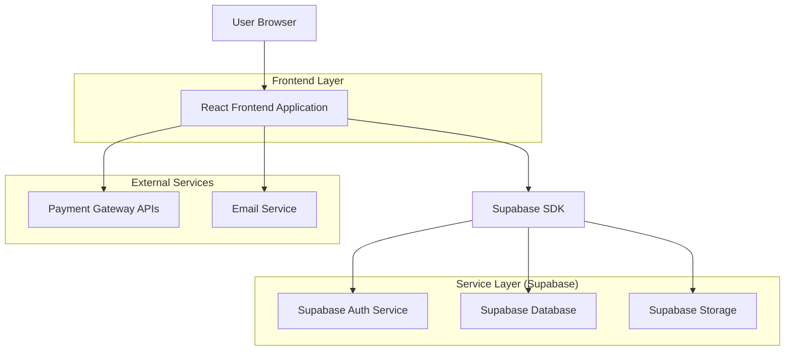
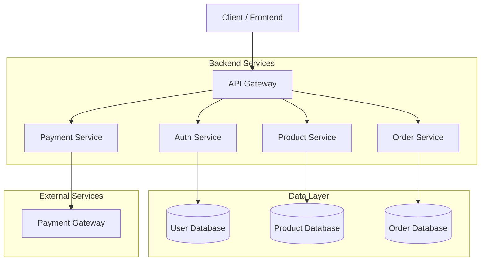
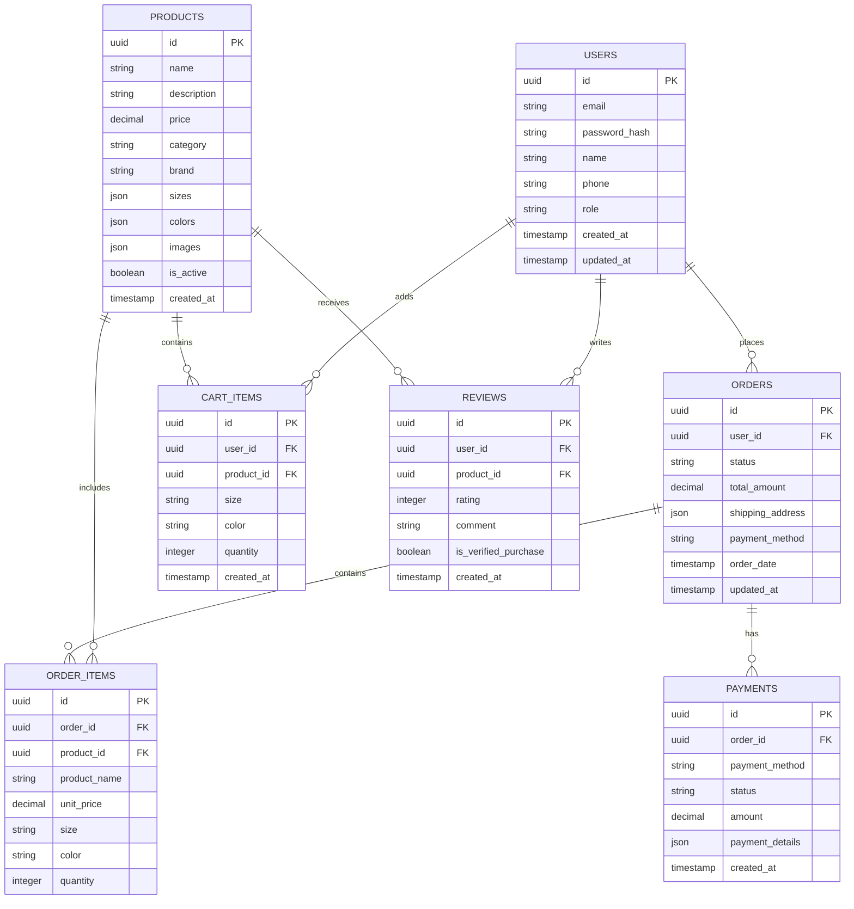

## 1. アーキテクチャ設計



## 2. 技術スタック

- **フロントエンド**: React@18 + TypeScript@5 + Vite
- **初期化ツール**: vite-init
- **スタイリング**: Tailwind CSS@3 + PostCSS
- **状態管理**: React Context API + Zustand
- **バックエンド**: Supabase (BaaS)
- **データベース**: PostgreSQL (Supabase提供)
- **認証**: Supabase Auth
- **ファイルストレージ**: Supabase Storage
- **決済統合**: Stripe API、PayPay API、Apple Pay
- **メール配信**: Supabase Edge Functions + SendGrid

## 3. ルート定義

| ルート | 目的 |
|-------|------|
| / | ホームページ、メインコンテンツとナビゲーション |
| /products | 商品一覧ページ、検索・フィルタリング機能 |
| /products/:id | 商品詳細ページ、画像ギャラリーと購入オプション |
| /cart | カートページ、商品管理と合計金額表示 |
| /checkout | 購入手続きページ、配送先情報入力 |
| /payment | 決済ページ、支払い処理 |
| /order-complete | 注文完了ページ、注文番号と確認メッセージ |
| /login | ログインページ、メールアドレス認証 |
| /register | 会員登録ページ、プロフィール情報入力 |
| /my-page | マイページ、ダッシュボードとメニュー |
| /order-history | 購入履歴ページ、過去の注文一覧 |
| /profile | プロフィール編集ページ、個人情報管理 |
| /support | カスタマーサポートページ、お問い合わせフォーム |
| /admin | 管理画面、商品・注文・在庫管理 |

## 4. API定義

### 4.1 認証API

**ユーザー登録**
```
POST /api/auth/register
```

リクエスト:
| パラメータ名 | パラメータ型 | 必須 | 説明 |
|------------|------------|------|------|
| email | string | true | メールアドレス |
| password | string | true | パスワード（8文字以上） |
| name | string | true | ユーザー名 |
| phone | string | false | 電話番号 |

レスポンス:
| パラメータ名 | パラメータ型 | 説明 |
|------------|------------|------|
| user | object | ユーザー情報 |
| session | object | 認証セッション |

**ユーザーログイン**
```
POST /api/auth/login
```

リクエスト:
| パラメータ名 | パラメータ型 | 必須 | 説明 |
|------------|------------|------|------|
| email | string | true | メールアドレス |
| password | string | true | パスワード |

### 4.2 商品API

**商品一覧取得**
```
GET /api/products
```

クエリパラメータ:
| パラメータ名 | パラメータ型 | 必須 | 説明 |
|------------|------------|------|------|
| category | string | false | カテゴリフィルター |
| min_price | number | false | 最低価格 |
| max_price | number | false | 最高価格 |
| size | string | false | サイズフィルター |
| color | string | false | 色フィルター |
| brand | string | false | ブランドフィルター |
| sort | string | false | ソート順（price, new, popular） |
| page | number | false | ページ番号 |
| limit | number | false | 1ページあたりの件数 |

**商品詳細取得**
```
GET /api/products/:id
```

### 4.3 カートAPI

**カートに追加**
```
POST /api/cart/add
```

リクエスト:
| パラメータ名 | パラメータ型 | 必須 | 説明 |
|------------|------------|------|------|
| product_id | string | true | 商品ID |
| size | string | true | サイズ |
| quantity | number | true | 数量 |

**カート更新**
```
PUT /api/cart/update
```

### 4.4 注文API

**注文作成**
```
POST /api/orders/create
```

リクエスト:
| パラメータ名 | パラメータ型 | 必須 | 説明 |
|------------|------------|------|------|
| items | array | true | 注文商品リスト |
| shipping_address | object | true | 配送先情報 |
| payment_method | string | true | 支払い方法 |
| total_amount | number | true | 合計金額 |

### 4.5 決済API

**決済処理**
```
POST /api/payment/process
```

リクエスト:
| パラメータ名 | パラメータ型 | 必須 | 説明 |
|------------|------------|------|------|
| order_id | string | true | 注文ID |
| payment_method | string | true | 支払い方法 |
| payment_details | object | true | 決済詳細情報 |

## 5. サーバーアーキテクチャ図



## 6. データモデル

### 6.1 データモデル定義



### 6.2 データ定義言語

**ユーザーテーブル（users）**
```sql
-- テーブル作成
CREATE TABLE users (
    id UUID PRIMARY KEY DEFAULT gen_random_uuid(),
    email VARCHAR(255) UNIQUE NOT NULL,
    password_hash VARCHAR(255) NOT NULL,
    name VARCHAR(100) NOT NULL,
    phone VARCHAR(20),
    role VARCHAR(20) DEFAULT 'user' CHECK (role IN ('user', 'admin')),
    created_at TIMESTAMP WITH TIME ZONE DEFAULT NOW(),
    updated_at TIMESTAMP WITH TIME ZONE DEFAULT NOW()
);

-- インデックス作成
CREATE INDEX idx_users_email ON users(email);
CREATE INDEX idx_users_created_at ON users(created_at DESC);

-- 初期データ投入（管理者）
INSERT INTO users (email, password_hash, name, role) 
VALUES ('admin@fashion-ec.com', '$2b$10$YourHashedPassword', '管理者', 'admin');
```

**商品テーブル（products）**
```sql
-- テーブル作成
CREATE TABLE products (
    id UUID PRIMARY KEY DEFAULT gen_random_uuid(),
    name VARCHAR(200) NOT NULL,
    description TEXT,
    price DECIMAL(10,2) NOT NULL CHECK (price >= 0),
    category VARCHAR(50) NOT NULL,
    brand VARCHAR(100),
    sizes JSONB DEFAULT '[]',
    colors JSONB DEFAULT '[]',
    images JSONB DEFAULT '[]',
    stock_quantity INTEGER DEFAULT 0,
    is_active BOOLEAN DEFAULT true,
    created_at TIMESTAMP WITH TIME ZONE DEFAULT NOW(),
    updated_at TIMESTAMP WITH TIME ZONE DEFAULT NOW()
);

-- インデックス作成
CREATE INDEX idx_products_category ON products(category);
CREATE INDEX idx_products_price ON products(price);
CREATE INDEX idx_products_brand ON products(brand);
CREATE INDEX idx_products_is_active ON products(is_active);
```

**注文テーブル（orders）**
```sql
-- テーブル作成
CREATE TABLE orders (
    id UUID PRIMARY KEY DEFAULT gen_random_uuid(),
    user_id UUID REFERENCES users(id) ON DELETE CASCADE,
    status VARCHAR(20) DEFAULT 'pending' CHECK (status IN ('pending', 'confirmed', 'shipped', 'delivered', 'cancelled')),
    total_amount DECIMAL(10,2) NOT NULL,
    shipping_address JSONB NOT NULL,
    payment_method VARCHAR(50) NOT NULL,
    tracking_number VARCHAR(100),
    order_date TIMESTAMP WITH TIME ZONE DEFAULT NOW(),
    updated_at TIMESTAMP WITH TIME ZONE DEFAULT NOW()
);

-- インデックス作成
CREATE INDEX idx_orders_user_id ON orders(user_id);
CREATE INDEX idx_orders_status ON orders(status);
CREATE INDEX idx_orders_order_date ON orders(order_date DESC);
```

**カートアイテムテーブル（cart_items）**
```sql
-- テーブル作成
CREATE TABLE cart_items (
    id UUID PRIMARY KEY DEFAULT gen_random_uuid(),
    user_id UUID REFERENCES users(id) ON DELETE CASCADE,
    product_id UUID REFERENCES products(id) ON DELETE CASCADE,
    size VARCHAR(10),
    color VARCHAR(50),
    quantity INTEGER NOT NULL CHECK (quantity > 0),
    created_at TIMESTAMP WITH TIME ZONE DEFAULT NOW(),
    UNIQUE(user_id, product_id, size, color)
);

-- インデックス作成
CREATE INDEX idx_cart_items_user_id ON cart_items(user_id);
CREATE INDEX idx_cart_items_product_id ON cart_items(product_id);
```

**レビューテーブル（reviews）**
```sql
-- テーブル作成
CREATE TABLE reviews (
    id UUID PRIMARY KEY DEFAULT gen_random_uuid(),
    user_id UUID REFERENCES users(id) ON DELETE CASCADE,
    product_id UUID REFERENCES products(id) ON DELETE CASCADE,
    rating INTEGER NOT NULL CHECK (rating >= 1 AND rating <= 5),
    comment TEXT,
    is_verified_purchase BOOLEAN DEFAULT false,
    created_at TIMESTAMP WITH TIME ZONE DEFAULT NOW(),
    UNIQUE(user_id, product_id)
);

-- インデックス作成
CREATE INDEX idx_reviews_product_id ON reviews(product_id);
CREATE INDEX idx_reviews_rating ON reviews(rating);
```

**Supabaseロール権限設定**
```sql
-- 匿名ユーザー（anon）への基本読取権限
GRANT SELECT ON products TO anon;
GRANT SELECT ON reviews TO anon;

-- 認証済みユーザー（authenticated）への全権限
GRANT ALL PRIVILEGES ON users TO authenticated;
GRANT ALL PRIVILEGES ON products TO authenticated;
GRANT ALL PRIVILEGES ON orders TO authenticated;
GRANT ALL PRIVILEGES ON order_items TO authenticated;
GRANT ALL PRIVILEGES ON cart_items TO authenticated;
GRANT ALL PRIVILEGES ON payments TO authenticated;
GRANT ALL PRIVILEGES ON reviews TO authenticated;
```